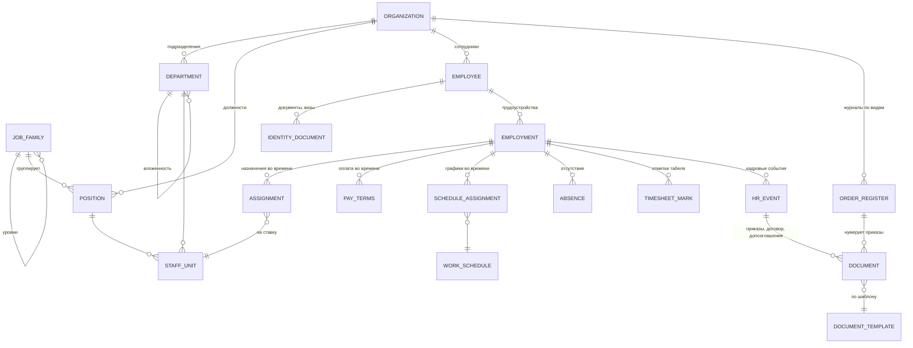

# Модель данных на уровне понятий

> Этап 4 · статус: **утверждено** · 2026-10-06
> Основа: [02-roles-and-scenarios.md](02-roles-and-scenarios.md), [03-features.md](03-features.md)

Здесь — понятия системы и связи между ними, без таблиц и технических деталей.

## Схема

## Уровень платформы

| Понятие | Что это |
|---|---|
| **Организация** | Юрлицо, подключённое к системе: тип (аффилированный / автономный филиал, сторонняя компания), страна, валюта (= валюта страны), язык документов |
| **Пользователь** | Тот, кто входит в систему: HR, администратор. **Не равен сотруднику** |
| **Доступ** | Пользователь ↔ организация: где пользователь работает как HR. Плюс отметка «HR холдинга» и «администратор платформы» |
| **Шаблон документа** | Шаблон приказа или договора: вид документа, страна, язык, версия |
| **Справочники** | Виды отсутствий, формы оплаты, виды документов личности и т. п. |

## Уровень организации

### Оргструктура

| Понятие | Что это |
|---|---|
| **Подразделение** | Узел дерева подразделений организации. Хранится **только текущая** оргструктура; закрытое подразделение помечается «закрыто», историю оргструктуры на дату не ведём |
| **Семейство должностей** | Группа должностей; семейства образуют дерево уровней (напр., «Финансы → Бухгалтерия») |
| **Должность** | Элемент справочника должностей организации, входит **ровно в одно** семейство |
| **Штатная единица** | Подразделение + должность + количество ставок (может быть дробным: 0,5; 0,25) |

### Сотрудник и работа

| Понятие | Что это |
|---|---|
| **Сотрудник** | Карточка человека **в одной организации**: ФИО, ФИО латиницей, дата рождения, гражданство, контакты. В другой организации тот же человек — другая карточка |
| **Документ личности** | Паспорт, удостоверение личности, виза: тип, номер, даты выдачи и окончания (только данные) |
| **Трудоустройство** | Период работы по трудовому договору: дата приёма, дата увольнения, основная работа или совместительство, отметка о регистрации договора в государственной системе. У сотрудника может быть **несколько** трудоустройств: одновременно (совместительство) и последовательно (повторный приём — продолжение той же карточки) |
| **Назначение** | Период внутри трудоустройства: штатная единица и доля ставки, с датами «с — по» |
| **Условия оплаты** | Период внутри трудоустройства: форма оплаты (оклад / оклад + премия / сдельная / почасовая) и размеры, в валюте организации |

**Всё, что меняется во времени у сотрудника** (назначения, условия оплаты, графики), хранится **периодами с датами действия**. Поэтому:
- изменения можно оформить **будущей датой**;
- можно увидеть, **кто где работал и на каких условиях на любую прошлую дату**.

### Кадровые события и документы

| Понятие | Что это |
|---|---|
| **Кадровое событие** | Приём, перевод, увольнение, оформление отсутствия — с датой вступления в силу. Событие меняет периоды (назначение, оплату, трудоустройство) и порождает документы. **Перевод** внутри организации — изменение назначения и/или оплаты в рамках того же трудоустройства, оформляется приказом и **дополнительным соглашением** к текущему договору |
| **Документ** | Сформированный по шаблону приказ, трудовой договор или дополнительное соглашение: номер, дата, язык, файл |
| **Журнал приказов** | Нумерация приказов **отдельно по видам** (напр., по личному составу, по отпускам) внутри организации |

Перевод между организациями — это **увольнение** в одной и **приём** в другой (две разные карточки).

### Отсутствия и табель

| Понятие | Что это |
|---|---|
| **Отсутствие** | Трудовой отпуск, отпуск без сохранения оплаты, отпуск по беременности и родам, больничный — с периодом |
| **Остаток отпуска** | Рассчитывается системой по правилам страны из стажа и оформленных отпусков **по каждому трудоустройству отдельно**; при повторном приёме — с нуля. Вручную не вводится |
| **График работы** | Шаблон рабочего времени: пятидневка, сменный (2/2 и т. п.) |
| **Назначение графика** | Какой график в какой период — **у трудоустройства**: при совместительстве у каждого свой график |
| **Отметка табеля** | Исключение из графика, внесённое вручную (кроме отсутствий — они подставляются сами) |
| **Табель** | Не хранится отдельно, а **рассчитывается**: график + отсутствия + ручные отметки за период |

### История изменений

Для всех понятий фиксируется **кто, когда и что изменил**. Это отдельно от периодов действия: периоды отвечают на вопрос «как было на дату», история изменений — «кто и когда это внёс».

## Решения по вопросам этапа

1. График — у трудоустройства: при совместительстве у каждого трудоустройства может быть свой график.
2. Должность входит ровно в одно семейство.
3. Оргструктура — только текущая, без истории на дату.
4. Остаток отпуска — по каждому трудоустройству отдельно, при повторном приёме с нуля.
5. Перевод внутри организации — дополнительное соглашение к текущему договору (то же трудоустройство) + приказ.
6. Нумерация приказов — отдельно по видам.
